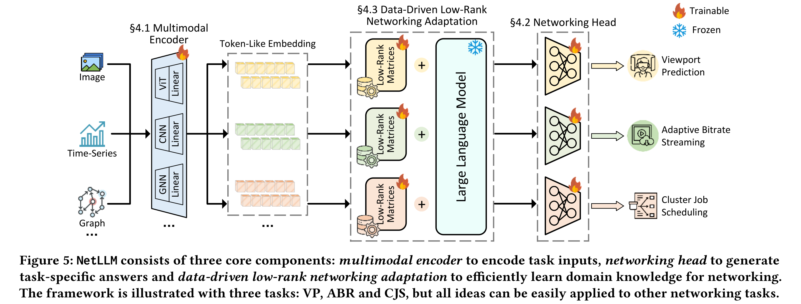

# NetLLM

## Introduction

现有的DNN模型具有两个缺点：

1. 高成本: 数据、计算资源；不同任务不同模型，成本高
2. 低扩展性: 模型不能通用

一个模型通用多个任务是全新的视角和思路。大模型可以证明，预训练获得的知识可以迁移到其他领域。将LLM应用到网络方向是可行的。

但存在挑战：

1. **输入信息差异。** 网络算法的输入，如吞吐量等信息，与正常LLM需要的文本输入不同
2. **答案生成低效。** LLM用language modeling head生成答案，这种方式只适合NLP，在网络领域存在一些缺点。
   1. 生成结果会有幻觉，即出现不需要的信息
   2. 由于一次只能生成一个token，想要得到完整的结果需要进行多次推理，浪费时间
3. **适应成本高。** NLP大模型要适应网络领域，需要对其进行微调获取特定领域的知识。在针对决策任务的时候，一般需要LLM与RL、网络环境等相结合，进行主动交互，收集经验。LLM交互需要时间，如果进行微调，特别是全参数微调，要消耗大量资源。

文章提出NetLLM，克服上述挑战: 

1. **输入信息差异。** 设计了多模态编码器。用特征编码器从原始输入中提取特征，利用可训练的线性层将特征映射到token-like embedding vectors，然后输入到LLM中。
2. **答案生成低效。** 移除了默认的LM head，引入了多种networking heads，生成特定任务的答案。每个网络头都是可训练的，将LLM的输出特征直接映射到特定任务的答案。这确保了LLM能够通过一次推理生成有效的多个答案，可以保证可靠性并减小生成的延迟。
3. **适应成本高。** 数据驱动的低阶网络适应(Data-driven low-rank networking adaptation, DD-LRNA)。DD-LRNA结合了数据驱动的适应管道(pineline)，使LLM适应预测和决策任务。对于决策，DD-LRNA采用数据驱动的强化学习技术来消除LLM和环境之间耗时的交互。该方法收集经验池作为训练数据集，以数据驱动的方式在该数据集上微调LLM。同时引入了额外的可训练低秩矩阵，供LLM学习网络知识。低秩矩阵降低了微调成本。

重要特性：

1. 兼容性。不同的LLM可以利用这个统一的框架来解决各种网络任务。
2. 可靠性。解决了幻觉问题，确保生成的答案始终有效。
3. 高效性。降低训练成本，减小了答案生成延迟。

## Design

三个主要模块：

Mulitimodal encoder. Challlenge 1

Networking heads. Challenge 2

Data-driven low-rank networking adaptation. Challenge 3

### Multimodal Encoder

