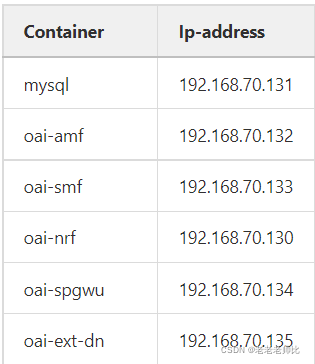

# OAI平台搭建
在校园网环境下二者无法连通，我使用手机热点。
## 1. 核心网
### 1.1 环境搭建
首先安装docker

随后运行以下命令
```bash
docker pull mysql:8.0
docker pull oaisoftwarealliance/oai-amf:develop
docker pull oaisoftwarealliance/oai-smf:develop
docker pull oaisoftwarealliance/oai-nrf:develop
docker pull oaisoftwarealliance/oai-udm:develop
docker pull oaisoftwarealliance/oai-udr:develop
docker pull oaisoftwarealliance/oai-ausf:develop
docker pull oaisoftwarealliance/oai-spgwu-tiny:develop
```

下载核心网代码：
```bash
mkdir OAI
cd OAI
git clone https://gitlab.eurecom.fr/oai/cn5g/oai-cn5g-fed.git

# 检测镜像
cd oai-cn5g-fed
git checkout -f v1.4.0
#同步所有git子模块
./scripts/syncComponents.sh 
```

### 1.2 核心网启动
启动
```bash
cd docker-compose
# 查看帮助
python3 core-network.py --help
# 启动核心网
python3 core-network.py --type start-basic
```
启动后操作
```bash
#启动后查看容器运行状况 
docker ps
#观察amf里可改字段的信息
vim docker-compose-basic-nrf.yaml
```
具体yaml文件观察启动时输出的日志

## 2. gNB搭建
### 2.1 环境搭建
**Build UHD**
```bash
sudo apt install -y libboost-all-dev libusb-1.0-0-dev doxygen python3-docutils python3-mako python3-numpy python3-requests python3-ruamel.yaml python3-setuptools cmake build-essential

git clone https://github.com/EttusResearch/uhd.git ~/uhd
cd ~/uhd
git checkout v4.5.0.0
cd host
mkdir build
cd build
cmake ../
make -j $(nproc)
make test # This step is optional
sudo make install
sudo ldconfig
sudo uhd_images_downloader
```
**Build OAI gNB**
```bash
# Get openairinterface5g source code
git clone https://gitlab.eurecom.fr/oai/openairinterface5g.git ~/openairinterface5g
cd ~/openairinterface5g
git checkout develop

# Install OAI dependencies
cd ~/openairinterface5g/cmake_targets
./build_oai -I

# Build OAI gNB
cd ~/openairinterface5g
source oaienv
cd cmake_targets
./build_oai -w USRP --ninja --gNB -C
```
以上Build流程可能因为github网络限制而失败，寻找github可以使用的时间即可。

### 2.2 gNB启动
```bash
# 检查USRP是否连接
uhd_find_devices

cd ~/openairinterface5g
source oaienv
cd cmake_targets/ran_build/build
sudo ./nr-softmodem -O ../../../targets/PROJECTS/GENERIC-NR-5GC/CONF/gnb.sa.band78.fr1.106PRB.usrpb210.conf --sa -E --continuous-tx
```

## 3. CN与gNB连接
### 3.1 核心网
```bash
# 输入如下代码，允许路由表规则 ，每次开机都需再次输入
sudo sysctl net.ipv4.conf.all.forwarding=1
sudo iptables -P FORWARD ACCEPT
```
进入相关yaml文件查看参数(以docker-compose-docker-compose-basic-nrf.yaml为例)：
amf处
```yaml
- MCC: 208
- MNC: 99
- REGION_ID: 128
```
文件内还会有一个十六进制的TAC参数，也需要修改。
### 3.2 gNB
```bash
sudo ip route add 192.168.70.128/26 via 192.168.28.153
```
192.168.28.153要换成你的核心网ip地址

然后在gNB电脑上ping一下下列地址，确保二者已经连通



**修改gNB配置文件**
```bash
vim gnb.sa.band78.fr1.106PRB.usrpb210.conf
```
```yaml
# Tracking area code, 0x0000 and 0xfffe are reserved values
    tracking_area_code  =  1;
    plmn_list = ({ mcc = 208; mnc = 99; mnc_length = 2; snssaiList = ({ sst = 1 }) });

NETWORK_INTERFACES :
    {
        GNB_INTERFACE_NAME_FOR_NG_AMF            = "demo-oai";
        GNB_IPV4_ADDRESS_FOR_NG_AMF              = "192.168.70.129/24";
        GNB_INTERFACE_NAME_FOR_NGU               = "demo-oai";
        GNB_IPV4_ADDRESS_FOR_NGU                 = "192.168.70.129/24";
        GNB_PORT_FOR_S1U                         = 2152; # Spec 2152
    };
```
其中plmn_list中的mcc和mnc要与核心网中的amf处的MCC和MNC一致，TAC也是如此。

NETWORK_INTERFACES中的ip地址要换成gNB本身的ip地址。

### 3.3 输出log文件
```bash
docker logs oai-amf > amf.log
docker logs oai-smf > smf.log
```
只列举出了部分，如果gNB与CN连接成功，amf.log中会有明显的显示。

## 4. UE与gNB连接

二者连接主要有两个步骤：

 - 对SIM卡进行编程
 - 修改核心网数据库

### 4.1 SIM卡编程
### 4.2 修改核心网数据库
```bash
docker-compose-host $: docker exec -it mysql /bin/bash
mysql-container$: mysql -uroot -plinux
mysql-container$: use oai_db;
mysql-container$: INSERT INTO `AuthenticationSubscription` (`ueid`, `authenticationMethod`, `encPermanentKey`, `protectionParameterId`, `sequenceNumber`, `authenticationManagementField`, `algorithmId`, `encOpcKey`, `encTopcKey`, `vectorGenerationInHss`, `n5gcAuthMethod`, `rgAuthenticationInd`, `supi`) VALUES
('208950000000031', '5G_AKA', '0C0A34601D4F07677303652C0462535B', '0C0A34601D4F07677303652C0462535B', '{\"sqn\": \"000000000020\", \"sqnScheme\": \"NON_TIME_BASED\", \"lastIndexes\": {\"ausf\": 0}}', '8000', 'milenage', '63bfa50ee6523365ff14c1f45f88737d', NULL, NULL, NULL, NULL, '208950000000031'),
```
选择数据库后也可以直接`show tables`查看数据库中的表，然后`select * from AuthenticationSubscription`查看表中的内容。