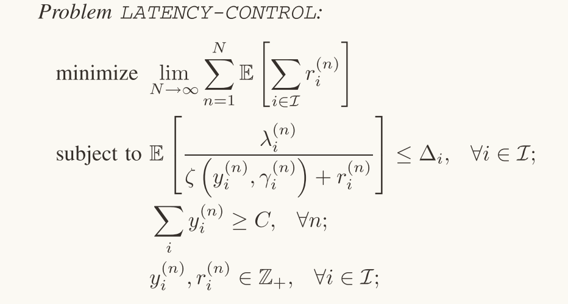
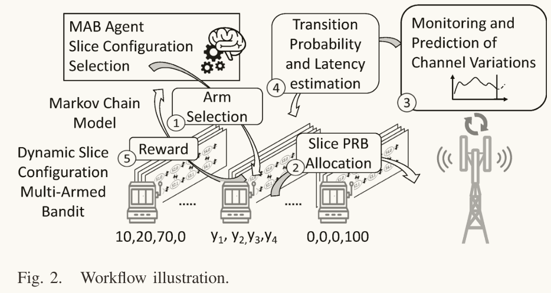
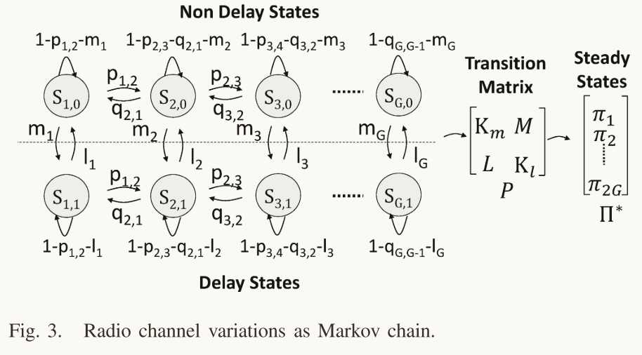
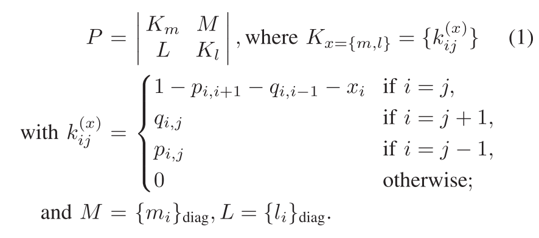
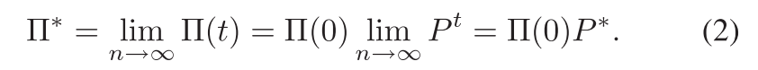
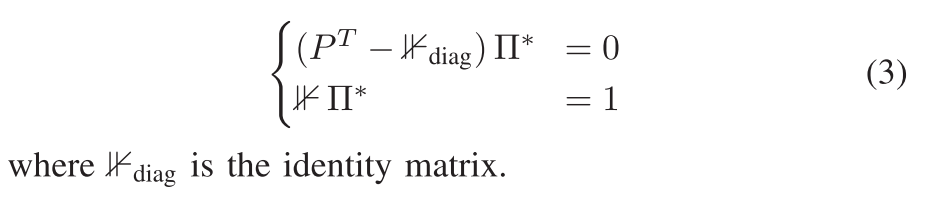
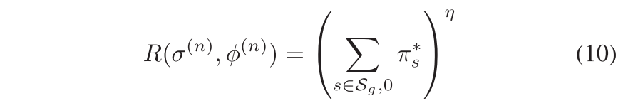
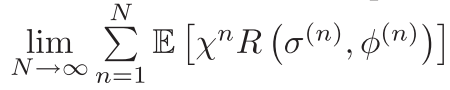
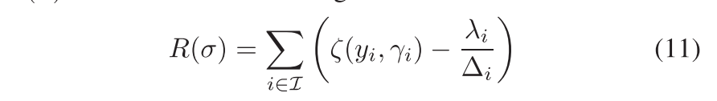
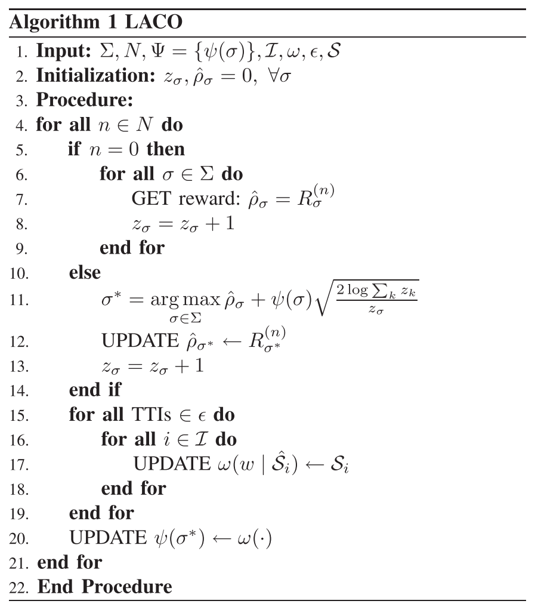

# 引言
## 文章主要贡献
- 引入离散时间马尔可夫过程（DTMC）用来捕捉（瞬时）聚合流量切片需求和无线信道变化的动态
- 提出了潜在变量（lantent variable）回归模型，用来预测DTMC的状态转移概率矩阵
- 将动态切片资源配置指定为马尔可夫决策过程（MDP）
- 设计了多臂老虎机（MAB）模型来指导决策过程，起到加速收敛的作用
- 详尽的实验设计
# 框架概述
## 问题定义

LATENCY-CONTROL优化问题
目标：
最小化总非服务流量需求。表达式中表现为，当$N{\to}\infty$时，所有时间槽$n$和所有切片$i$的延迟$r_{i}^{(n)}$的期望值之和。
约束条件：
${\lambda}_{i}^{(n)}$是时隙内瞬时总流量需求 ，$\zeta(y,\gamma)$返回分配的PRB数量$y_{i}^{(n)}$和SNR级别$\gamma_{i}^{(n)}$最后服务可以提供的bit数。同时引入$r$表示时隙$n$期间未服务的bit数。
<font color=blue><b>
第一个约束条件是：流量需求除以可服务的比特数+未被服务的比特数，获得当前的延迟情况，并且不能小于$\Delta_{i}$：切片$i$的延迟容忍度。
第二个约束条件是：所有切片的配置和不能小于当前BS的总容量。
第三个约束条件是：切片的配置和延迟必须是非负整数。
</b></font>
解决方法：使用网络切片常用的两层调度方法。
```shell
Inter-Slice（高层）：
	在不同的网络切片之间分配资源
	考虑整体效率
Intra-Slice（低层）：
	在切片内部发生
	将切片的资源分配给切片内的用户或业务流
	根据用户的具体需求
	需要快速响应
```
文章的工作集中在高层，即关注片间调度程序。
## 工作流程
如果时间$n$给定，那么上文提到的LATENCY-CONTROL可以很容易地线性化，并且使用标准的优化工具来解决。
而瞬时信噪比和用户的瞬时总流量需求不是平稳分布，使用标准优化工具并不是好的选择。
为了解决这个问题，文章提出了两重方法：
- 根据先前的观察对通道和流量需求变化进行建模
- 迭代地调整网络切片的配置达成SLA要求。也就是，根据网络情况和用户需求实时进行网络切片资源分配的调整。
<font color=blue><b>
每一次决策周期更新一次切片配置。
</b></font>

图二是LACO的工作流程。
MAB首先进行决策，选出最合适的臂（Arm），根据Arm的策略进行PRB分配，监测和预测信道的动态变化，进行转移概率和延迟估计，根据反馈生成奖励函数引导MAB进行下一步决策。
# 离散时间马尔可夫模型（DTMC）
通过该模型，分析系统动态，来计算预期的信道条件、延迟容忍度的违规情况。
信道变化和流量控制都是每个切片单独分开看的，所以每个DTMC都是单独处理的。
同时如果有需求，也可以利用简单的线性组合方法获取全局的DTMC模型。
同时，为了便于处理，文章考虑了一个单一的虚拟用户$u_{i}$，其代表某个网络切片所有的用户$U_{i}$，虚拟用户的流量需求是由该网络切片内用户的需求综合起来的。这样将需求合并成一个统一的、综合的需求，可以简化网络资源的管理和问题的复杂度，同时满足整体需求。
假定了有限数量的信道质量水平$G$，可以限制每个瞬时用户质量$\gamma_{i}$，如图三所示。

这个$large$ ${G}$允许了信道质量水平在细粒度和粗粒度间转换，给运营商不同的选择：细粒度$\to$更好的性能、测量精度，粗粒度$\to$更好的效率、加速收敛。$G$部分在part 4中详细讨论。
接下来对无线通信信道变化进行建模。
信道变化用一个离散时间随机过程$X_{t}$来表示，取值于有限离散状态空间$\mathcal{S}={ \lbrace S_{0,0},\dots,S_{g,d},\dots,S_{G,1} | 0 \leq g \leq G, d\in\lbrace0,1\rbrace  \rbrace }$。g是当前信道质量等级，d表示是否超出了切片服务水平协议（SLA）规定的延迟阈值，1表示超过，0表示未超过。
在考虑瑞利分布的无线信道条件时，通常将变化建模为连续状态的顺序访问，因为信道的变化速度不会快于马尔可夫链的时隙。因此，将从等级$g$改善到等级$g+1$的用户信道条件的概率定义为$p_{g,g+1}$；从等级$g$恶化到等级$g-1$的概率定义为$q_{g,g-1}$。
根据研究，精确的、细粒度的调度策略可以改善信道条件，但增加了额外的开销，与文章轻量级解决方案的思想不符合。
最终建模：给定分配给特定切片$y_{i}$的可用物理资源块（PRB）、信道质量水平$g$和时隙内的总体流量需求，我们将发生延迟约束违规的概率建模为$m_{g}$，在约束范围内的概率是$l_{g}$。可以用二维离散时间马尔可夫链：$M:= (\mathcal{S,P})$,$\mathcal{P}$表示下列转移概率：

- 概率假设：从最高信道质量等级G提升到G+1的概率$p_{G,G+1}$为0，从最低信道质量等级1降低到0的概率$q_{1,0}$为0。也就是说，信道质量不会超出预设的最高等级。
- 矩阵维度：$K_{x=\{m,l\}}$，$M、L$的大小是$[G\times{G}]$,$P$的维度为$[2G\times{2G}]$。
- 时间齐次：假设转移概率不依赖于我们正在评估的特定时隙，可以将DTMC定义为时间齐次的马尔可夫链。其中过程$X_{t}$根据$\prod(t)=\prod(0)P^{t}$演化。行向量$\prod(t)$和$\prod(0)$表示在时隙$t$和$0$的一阶状态概率分布。
- 长期行为评估：评估长期行为，需要计算处于每个定义状态的稳态概率${\prod}^{*}=\{\pi^{\ast}_{s}\}$。
最后得出：

上述马尔可夫链是不可约的，也就是说，从任何状态出发，都有可能通过一系列的转移到达其他状态。即，这个马尔可夫状态空间内没有孤立的部分。
通过全概率公式和公式(1)，可以得到最后的稳态概率分布：


# DTMC监控和预测
马尔可夫链的渐进行为取决于状态转移概率矩阵P，而P依赖于切片流量需求和无线信道变化的**随机过程**。当考虑到延迟控制的目标和估计的准确性时，已有的模型就存在一些不足之处。
为了估计这些转移概率，文章选用了无监督学习的方法，基于先前的数据进行估计。依赖于概率潜变量理论，重新定义了DTMC的转移概率。

# 马尔可夫决策过程
将决策过程建模为马尔可夫决策过程（MDP），由状态集$\sum=\{\sigma\}$、动作集$\Phi=\{\phi\}$、转移函数$T=(\sigma,\phi,\sigma^{\prime})$、奖励函数$R(\sigma,\phi)$组成。

状态集表示了不同租户之间的无线资源分割选项，也可以叫做切片配置$c_{0}=\{y_{1},y_{2},\dots,y_{I}\}$，其中$y_{I}$表示物理资源块（PRB）的分配，总和是总容量$C$。

每个决策周期都会发出一个切片配置；转移函数描述了从状态$\sigma$到状态$\sigma^{\prime}$的动态，存在一个概率$P(\sigma^{\prime}|\sigma,\phi)$，代表给定前一个状态$\sigma$和动作$\phi$，转移到状态$\sigma^{\prime}$的概率。奖励函数$R(\sigma,\phi)$表示在状态$\sigma$下采取动作$\phi$的奖励。

文章考虑具有无限时间范围的MDP，并制定了一个系数$0<\chi<1$，未来的奖励按照这个系数进行折扣，来保证获得的总奖励是有限的。

在处理MDP时，常见的做法是为agent定义一个策略$P^{(n)}:\sum^{(n)}\to{\Phi^{(n)}}$，是一个函数，决定在指定的状态与时间下，执行的action。当马尔可夫决策选择出了一个特定的策略，就自动确定了每个状态的下一步行为，令结果的组合表现得类似于一个马尔可夫链。

决策代理（decision agent）的最终目标是找到最大化预期总奖励的策略，或找到最大化价值函数的策略$P^{*}$。
## 奖励函数
每个状态都需要与影响代理的奖励相关联，原因是，我们需要将操作奖励与违背SLA的概率结合起来。

利用：



$s$是所有状态$S_{g,0}$的索引，$\eta\in[0,1]$则是由设施提供商界定，趋于0时提供奖励函数中的操作公平性，趋于1时保证延迟收到控制时的最大可能性。目标是最大化获得的预期总奖励，公式是预测总奖励的极限值。$\chi$是折扣因子，在0，1之间，表示未来的奖励在今天的价值会逐渐减少；R是奖励函数，表示在状态$\sigma$下采取动作$\phi$的奖励，属于即时奖励。



由于马尔可夫的全连接特性，即每个状态都可以从其他状态到达，我们的目标就转换成n最大化时每个决策时期根据公式(10)的瞬时奖励。
观察集的大小能够帮助我们更准确地进行估计转移概率。也就是说，观察集的大小决定了我们能否做出更好的决策。
## 复杂性分析
当我们可以完全表征出我们定义的MDP后，我们就可以使用动态规划（如值迭代）来解决它。动态规划的方法需要探索状态空间（多次）和相关奖励，会出现维数灾难问题，在实际条件下可行性较低。需要选用一种减少状态空间探索的，加速学习过程的方法。
## 多臂老虎机问题
- 场景：在线决策的问题已经通过多种数学工具解决，而关于实时信道质量和有效流量需求的信息有限，令运营商像面临很多选择的**赌徒**一样选择分配给正在运行的切片的无线电资源。这就陷入了EE（exploration and exploitation）困境：需要仔细平衡已经在切片上应用的操作与配置，因为在过去这提供了最好的收入；同时如果探索新的配置可能最终产生更高的收入。这类决策过程被描述为多臂老虎机问题。
- MAB：模仿选择最佳老虎机以获得最佳回报的行为。每个老虎机代表一个可能的行为选择，每个行为选择会带来一定的收益，收益是不可预测的，只能通过之前的观察迭代推断$\longrightarrow$同我们的场景：捕获的信道质量和流量需求的随机性相符合。同时每个老虎机都可以代表一个特定的切片配置。
- 目标和指标：该问题的最终目标是，有限轮数后最大化总体增益，由一个$regret$ $\Omega$来评估。评估指标的定义是：实际采取的行为与最优预期行为之间的奖励差距。
- 固有问题：见公式11，是一个瞬时的奖励函数
  $\zeta(y_{i},\gamma_{i})$：$y$为切片配置，$\gamma$为信道质量，$\zeta$计算使用$y$的配置下可以提供服务的bit数。$\lambda$是切片流量需求。
  
  使用这种奖励函数开销较低，因为只需要计算在选择切片配置之后产生的延迟，但是在探索多种配置之后，只会收敛到接近最优的解决方案，导致训练时间过长$\longrightarrow$这也是MAB的固有问题：对底层系统结构视而不见。为了解决这个问题，文章使用了一种模型辅助方法，利用系统模型来指导使用系统信息的探索-利用（EE）过程。
- 奖励函数新定义：与传统的（公式11）相比，文章将奖励定义为访问延迟超过切片SLA的期望值，有两个优点。
  - 优点1:在初始训练期间，与MDP每个状态相关的DTMC会使用更精确的转移概率值来进行更新，有助于计算稳态概率，令奖励计算更贴近系统实际运行情况，从而提高策略的有效性。
  - 优点2:选择切片配置时，考虑了信道质量和流量需求的随机性，减少了需要考虑的状态空间，提高了系统的整体性能。
- 算法：有许多算法基于"从之前的观察中学习"这一思想实现，但是其中的一个主要问题是，短期内收集奖励可能对选择最佳老虎机的决策产生负面影响，文章依赖于一种UCB修改算法，该算法衡量到当前时间截止时收集的奖励，同时通过跟踪每个老虎机被选择的次数$z_{\sigma,n}$来衡量对奖励分布估计的置信度。伪代码如下：

- 输入：
  - $\sum:$状态空间的总数，包含所有可能的切片配置
  - $N:$决策周期
  - $\Psi:$精度值
  - $\mathcal{I}:$切片索引集合
  - $\omega:$权重
  - $\epsilon:$观测的时间间隔
  - $\mathcal{S}:$观测到的切片配置
- 初始阶段，算法会探索所有老虎机，也就是探索所有可能的切片配置$\sigma$，期望获取一致的奖励(2-6行)
- 选择最大化经验分布$\rho_{\sigma}$的最佳配置，来计算置信值。置信值与探索该特定配置的次数和为相关DTMC计算转移概率的准确性。与传统UCB算法不同，文章定义了一个马尔可夫精度值$\psi(\sigma) = \left( \frac{(\sum_{w} \omega(w | \hat{\mathcal{S}}_i))^2}{W \sum_{w} \omega(w | \hat{\mathcal{S}}_i)^2} \right)$，其中$\psi(\sigma)$取决于通过之前的观测$\hat{\mathcal{S}_{i}}$所获得的权重$\mathcal{w}(\cdot)$，当DTMC没有相关的观察可以构建转移概率时，这个函数返回1，有足够的观察时，该函数趋近于0；这个函数在每次决策周期结束后更新(20行)，做到监测了上一次决策对马尔可夫潜变量的影响后进行(15-19行)。
## 遗憾分析
遗憾指实际收益与可能的最大收益之间的差距。
用数学方法来计算对于多臂老虎机问题的解决方案LACO的边界。


