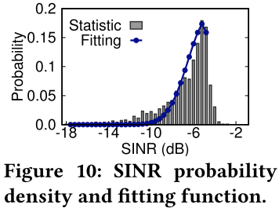

# 背景

随着5G的兴起，出现许多新的应用，如远程手术、延迟关键型视频分析等。这些应用需要消耗大量的带宽和计算资源，同时对低延迟有着极大的需求，以自动驾驶视频分析为例子，延迟高可能会导致交通事故。因此，5G网络需要提供低延迟、高带宽、高可靠性的服务。

为了解决这个问题，出现了MEC技术，将计算设备放在网络边缘，减小了传输路径，也减少了端到端的传输延迟。同时也支持了一些计算能力较弱的用户设备（UE）。

**尽管移动边缘计算被视为5G生态系统的关键组成部分，旨在支持具有严格延迟要求的应用，但实际操作中5G与MEC之间缺乏协调，导致无法满足这些要求，从而产生不可接受的长响应延迟。因此，解决这个问题对于确保延迟敏感应用的服务质量(QoS)和用户体验(QoE)至关重要。**

传统MEC存在问题：忽略对边缘辅助应用的QoE研究。进行实际测试后，以延迟敏感型视频分析为例，发现传统MEC的QoE较差。原因：5G RAN和MEC间的松耦合设计。二者间联系不互通，MEC不知道RAN的无线动态，RAN不知道QoE需求，导致相应延迟过长。

解决意义：减少了延迟敏感型服务的延迟，提高了视频分析的QoE，为时间敏感型视频分析的应用提供了网络技术上的支持。

# 解决方法

Tutti：整合了RAN与MEC。预测应用层信息与物理链路动态，生成需求规则，并根据DDL进行资源分配，是一个轻量级的，部署在用户空间的，精确定制应用服务需求，并进行强制资源分配的框架。

应用层信息预测：使用GRU对下一帧的大小进行预测

链路动态预测：根据测量得到的SINR曲线，拟合截断高斯分布进行预测

需求规则生成：依据3GPP 5G NR规范进行PRB量化

DDL敏感的资源分配：（1）时间充足时，在不损害其他用户的QoE需求的情况下，为延迟关键型用户提供足够的资源。（2）DDL将至，延迟关键用户优先级会急剧增长。同时，Tutti会保证当前PRB数量能够满足当前资源调度单元（TTI）的需求，若无法满足则下一TTI多分配。

Tutti：耦合了RAN与MEC，确保延迟敏感应用的服务质量（QoS）和用户体验（QoE）。通过预测应用层信息和物理链路动态，Tutti能够生成精确的需求规则，并根据数据传输截止时间（DDL）进行灵活的资源分配。作为一个轻量级、用户空间部署的框架，Tutti能够精确定制应用服务需求，并强制执行资源分配。

核心功能包括：

- **应用层信息预测**：利用门控循环单元（GRU）技术，预测下一帧的数据大小，从而提前准备所需资源。
- **链路动态预测**：通过分析信号干扰噪声比（SINR）的测量曲线，采用截断高斯分布模型进行准确预测。
- **需求规则生成**：根据3GPP 5G NR规范，对物理资源块（PRB）进行量化，形成需求规则。
- **DDL敏感的资源分配**：在时间充足时，保障不影响其他用户QoE的前提下为延迟关键型用户分配充足资源；当DDL迫近时，提高延迟关键用户的资源优先级，并确保当前物理资源块（PRB）数量满足当前传输时间间隔（TTI）的需求，如有必要，下一TTI增加资源分配。

Tutti通过这些策略，确保了5G网络中延迟敏感应用的高效和可靠运行，是5G与MEC协同工作的关键技术。

# 其他工作

## OnSlicing

通过在线深度强化学习（DRL）优化移动网络资源使用和服务级别协议（SLA）遵从的系统。旨在虚拟化网络基础设施，并提供定制的网络切片，以满足各种具有不同需求的应用，例如移动增强现实（MAR）、视频流媒体、车辆到一切（V2X）和物联网（IoT）。

OnSlicing的主要特点包括：

- **为每个切片量身定制的学习：** 为每个切片定制学习，确保最小化资源使用同时保持SLA合规性。

- **考虑约束的策略更新方法：** 调整强化学习过程以考虑SLA违规和资源约束，降低SLA违规风险。

- **主动基线切换机制：** 使用基于规则的解决方案作为备用选项，在在线学习的早期阶段防止SLA违规。

- **分布式网络协调：** 协调分布式网络基础设施的资源分配，确保有效利用资源而不超出基础设施能力。

- **从基线中脱机学习：** 利用脱机学习模仿基于规则的策略，提高在线学习性能并减少初始SLA违规的可能性。

该系统在集成了4G LTE、5G NR、软件定义网络（SDN）和边缘计算技术的测试平台上实现，与传统的基于规则和在线DRL解决方案相比，显示出显著的资源使用减少和几乎零SLA违规。

## LACO

- 引入离散时间马尔可夫过程（DTMC）来捕捉流量切片需求和无线信道变化的动态

- 提出了潜变量回归模型来预测DTMC的状态转移概率矩阵

- 将动态切片资源配置指定为马尔可夫决策过程（MDP）

- 设计了基于多臂老虎机（MAB）的模型来指导决策过程，起到加速收敛的作用

- 文章的工作关注网络切片的高层调度：在不同的网络切片之间分配资源，考虑整体的效率。

## RadioSaber

片间调度将片内作为自己算法的子程序

可借鉴的想法：

文章将片间调度逻辑分成两个步骤：

  1. 计算TTI中每个片的RB配额

  2. 以信道感知的方式，采用贪婪算法，将RB分配给每个片

RadioSaber首先基于每个切片的权重计算每个切片的RBG(Resource Block Group)配额。假设每个TTI中的RB数和RBG数分别是|RB|和|RBG|。

再维护一个滚动偏移量，对每个TTI每个切片获得的RB数量进行动态调整

# 优化思想

1. 使用基于transformer的强化学习模型，将Tutti中的多步预测及分配过程融合成一步决策

2. 发挥transformer变体在时间序列预测上的优势，使用多维时间序列模型，将链路动态和应用层信息预测整合，基于需求规则及DDL敏感规则进行资源分配

# 部分参考文献

[1] Liu Q, Choi N, Han T. OnSlicing: online end-to-end network slicing with reinforcement learning[C]//Proceedings of the 17th International Conference on emerging Networking EXperiments and Technologies. 2021: 141-153.

[2] Chen Y, Yao R, Hassanieh H, et al. {Channel-Aware} 5G {RAN} Slicing with Customizable Schedulers[C]//20th USENIX Symposium on Networked Systems Design and Implementation (NSDI 23). 2023: 1767-1782.

[3] Zanzi L, Sciancalepore V, Garcia-Saavedra A, et al. LACO: A latency-driven network slicing orchestration in beyond-5G networks[J]. IEEE Transactions on Wireless Communications, 2020, 20(1): 667-682.

[4] Xu D, Zhou A, Wang G, et al. Tutti: coupling 5G RAN and mobile edge computing for latency-critical video analytics[C]//Proceedings of the 28th Annual International Conference on Mobile Computing And Networking. 2022: 729-742.

[5] Li W, Luo H, Lin Z, et al. A survey on transformers in reinforcement learning[J]. arXiv preprint arXiv:2301.03044, 2023.

[6] Ekambaram V, Jati A, Nguyen N, et al. TSMixer: Lightweight MLP-Mixer Model for Multivariate Time Series Forecasting[J]. arXiv preprint arXiv:2306.09364, 2023.

[7] Zheng Q, Zhang A, Grover A. Online decision transformer[C]//international conference on machine learning. PMLR, 2022: 27042-27059.
