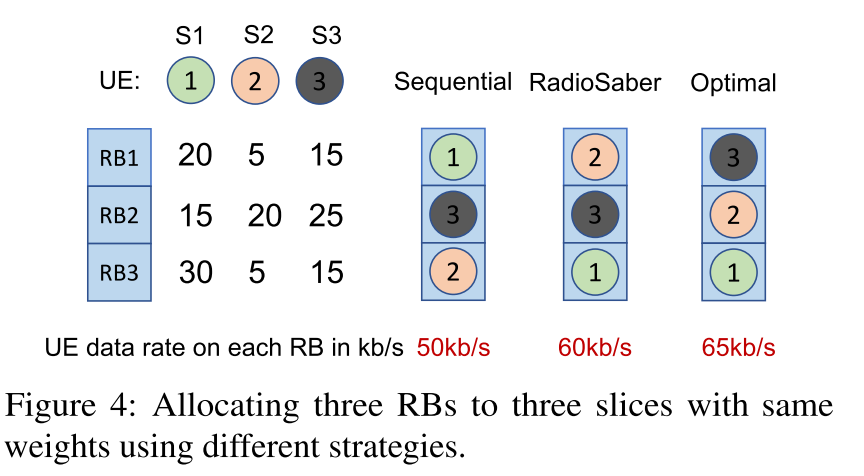
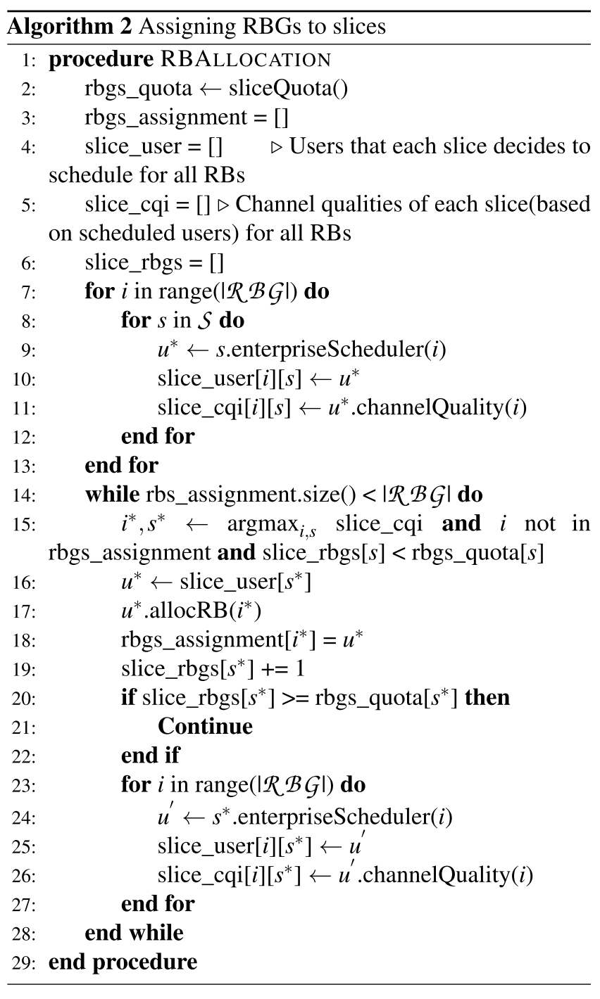
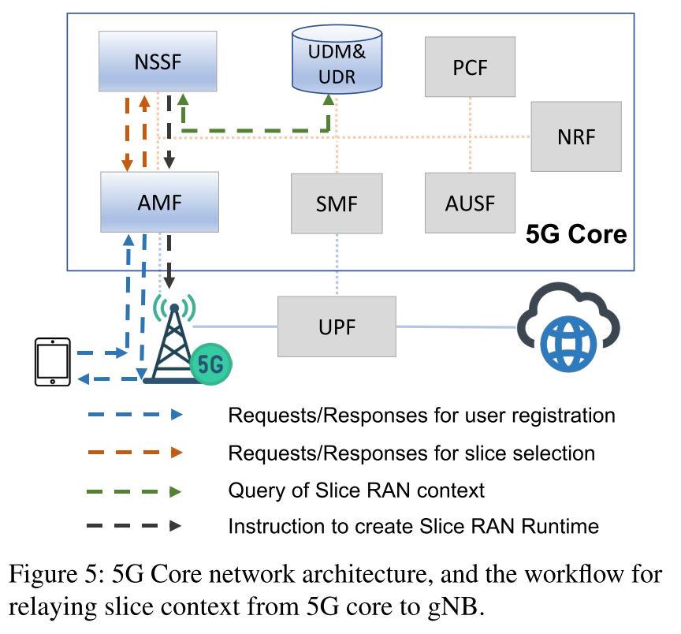

# Channel-Aware 5G RAN Slicing with Customizable Schedulers

文章主要关注5G RAN切片，即切片间的划分和单个切片内的资源分配，也就是片间和片内的调度。但是片间和片内的调度器存在循环依赖的问题，这使得很难将这两个切片级别结合起来共同感知。文章发现，如果将片内和片间调度器换成贪婪算法，循环依赖可以被打破。于是，文章设计了RadioSaber，将片间调度和片内调度结合起来，**执行信道感知的片间和片内调度(inter-slice and enterprise scheduling)。** RadioSaber的吞吐量很高，同时满足了片间的公平性和可定制的调度策略。

# 1. Introduction

网络切片：在不同的服务或用户群中划分网络资源，创建虚拟的可定制网络。使得单个用户$\to$用户组，支持具有不同需求的新应用程序。

用户组会与运营商签订服务等级协议(SLA)，提供两个功能：
- 管理服务类型和分配给切片的资源总量(提供精准的低延迟通信或大规模的物联网连接)
- 允许定制虚拟网络并对网络资源进行动态管理(在不同时间对关键远程手术流量设置优先级)

文章主要讨论5G RAN切片，目的是将基站的物理层资源分配给连接在该基站上的设备的不同enterprise。这些资源大概包括时隙和传输子带等。

理想情况下，资源是这么分配的：
- 高频谱效率
- 遵循SLA协议，保证公平性
- 允许自定义调度策略

困难：无线信道质量的动态变化

过去的工作：考虑到了信道感知频谱分配问题、分层资源调度问题、移动虚拟网络运营商背景下的RAN虚拟化问题，但这些工作只能考虑同一切片内用户的信道质量。也就是说，片间调度器不考虑信道质量给切片分配资源后，片内才考虑信道质量给用户分配资源——会显著降低吞吐量。

信道感知调度在二者间的应用是**先有鸡还是先有蛋的问题。** 二者都需要获取对方的资源分配情况来进行信道感知调度，同时不进行信道感知调度就无法确定本身的资源分配情况，这就是二者间的循环依赖问题。一种可能的解决办法是枚举出所有可能的资源分配方法，但复杂度极高，没有应用价值。

RadioSabor：在片间调度器和企业调度器上实现信道感知资源分配，同时允许每个企业定制其调度策略。

设计想法：由于二者都需要在基站上进行实时调度，因此片间调度器可以将企业调度算法作为自己算法的子程序。

**"如果我们将资源X给切片A，片A中的哪个用户将获得资源X？"**，这段话是RadioSabor的主要思想。按照这句话的思路，如果企业调度器能够回答片间调度器的查询，而不考虑其他因素、不依赖于片间分配器给它分配的其他资源，那么片间调度器就能在考虑信道质量的情况下进行资源分配。这样就可以确定将某一资源分配给某一切片后能够获得最佳的信道质量，让网络资源管理更高效和公平。

但是，回答这个查询也限制了企业可以运行调度策略的空间，这使得企业调度器必须在不考虑未来可能获得的其他资源的情况下，决定如何分配当前的资源——即时、独立地对资源进行分配决策。分配时，在考虑过去资源分配情况的基础上遵循贪婪算法，只考虑当前最好的选择，不考虑未来所有可能的情况。这样，RadioSaber能够适应既感知信道又灵活满足不同分片需求的策略。

贡献：
- 提出了在片间调度器和企业调度器上都都具有通道感知能力的RAN切片
- 提出了新的RAN虚拟化框架，抽象化物理层调度，同时为企业提供调度器接口
- 效率、公平

# 2. Background and Related Work 

背景：资源块、数据速率、感知信道的调度、RAN分片

相关工作：NVS(Network Vertualization Substrate，网络虚拟化底层)。NVS的工作方式是，在一个传输时间间隔(TTI)内将所有资源块分配给一个单独的切片，不考虑信道质量。该算法采用加权轮询机制在分片间切换，以达到SLA规定的每个切片的目标吞吐量。NVS允许企业调度器考虑信道质量，而片间调度器不考虑信道质量。

过去的工作也考虑了支持切片间的动态需求和截止日期，但所有的工作都默认片间调度器不知道信道质量的条件下进行资源分配。

# 4. RadioSaber's Design

**设计目标：**
RadioSaber解决了在k个片上划分N个RB(一个或多个TTI)，然后在该片内的UE上划分分配给每个片的RB的问题。

满足以下目标：

- 切片间的加权公平性：每个分片必须获得其公平的资源块份额。
- 高频谱效率：系统必须高效地分配RBs，以最大化系统吞吐量。
- 可定制的企业调度程序：提供表达性接口，允许指定和运行调度策略。

## 4.1 Inter-Slice Scheduler(片间调度器)

文章将片间调度逻辑分成两个步骤：

  1. 计算TTI中每个片的RB配额
  2. 以信道感知的方式，采用贪婪算法，将RB分配给每个片

### 计算切片份额

RadioSaber首先基于每个切片的权重计算每个切片的RBG(Resource Block Group)配额。假设每个TTI中的RB数和RBG数分别是$|\mathcal{RB}|$和$|\mathcal{RBG}|$。

一种简单的策略：将切片s的配额计算为$w_{s}\times|\mathcal{RBG}|$，$w_{s}$是切片的归一化权重。

但这种方法有一些不实际性：

  1. 非整数：这种方式计算的配额可能是非整数的，而且可能小于1，这与其他切片的数量、权重有关。不能对RBG进行非整数分配。
  2. 分配不均：如果$|\mathcal{RB}|$不是每个组中RB数量的整数倍(如k倍)，会导致最后一个RBG有较少的RB。

RadioSaber的思路：维护一个偏移量来考虑这些因素，偏移量是由每个分片的理想的目标资源块份额得到的。这个偏移量将会滚动到下一个传输时间间隔(TTI)。

偏移量就是实际获得的资源块份额和应得的RB数目之间的差异，新切片偏移量为0

首先计算每个切片的目标份额，这个数值用RB的数量表示。

表达式为$|\mathcal{RB}|\times w_{s}$ - rbs_offset_[s]

就是用其在TTI中的绝对加权份额减前一个TTI的滚动偏移量，新切片的偏移量为0。

然后计算切片的配额，这个数值用RBG的数量表示。将其设置为目标数额除以k并向下取整。

由于向下取整，会导致所有切片的配额总和小于可用的RBG数量，文章考虑将随机一个切片的配额增加1(最小整数值)，直到extra_rbgs < 0。

这么分配可能导致切片获得的RB数量不合适，文章通过更新每个切片的偏移量来捕获这一点。在计算下一个TTI的配额时，当前配额超过其公平配额的切片将获得正向偏移量和较低的份额；而当前配额低于其公平配额的切片将获得负向偏移量和较高的份额。

### 将RBG分配给切片

为了最大化频谱效率，在给定切片配额的情况下，要以信道感知的方式将RGB分配给切片。

即使我们假设与每个RBG的每个切片相关联的信道质量是已知的，计算最大化总速率的RBG的最优分配，同时遵守每个切片的RBG配额是一个NP-hard问题。所以，贪婪的启发式方法是找到这个问题解决方案(可能是次优)的一个自然选择。更重要的是，贪婪方法允许片间调度器有效地查询企业调度器，确定了RBG的信道质量。

基本分配逻辑：每个TTI中，RadioSaber贪婪挑选一个RBG，将其分配给在这个RBG上能获得最好信道质量的分片，一旦分片获得了该有的配额，那么就不会再获得更多的RBG。

图4，是时序算法、RadioSaber算法和最优算法的对比。

时序算法：按照顺序将RBG分配给具有最大速率的切片，直到配额耗尽，50kb/s的速率。

RadioSaber算法：按照信道质量降序分配，60kb/s的速率，在每次迭代中贪婪地选择最佳的RBG-切片映射，取得了次优的结果。RS要考虑当前的信道条件，试图在每次分配时最大化数据速率。

优化算法：最快，但需要全局遍览，消耗资源和时间，NP-hard。

RS的算法伪代码：

1. 初始化(1-6)

   - 获取各个分片的RGB配额
   - 初始化用于跟踪分配的数组
   - 初始化user用户数组、cqi信道质量数组
   - 初始化rgbs数组

2. 为未分配的RBG计算跨片的最大信道质量(7-13)

   - 对于未分配的 $|\mathcal{RBG}|$ ，算法遍历每个分片，使用企业调度器来确定每个RBG的最优用户和这个用户的信道质量。

3. 分配RBG

   - 当还有RBG可以分配时，找出信道质量最高的RBG( $i^*$ )和对应的分片( $s^{*}$ )，条件是该RBG尚未被分配且该分片的已分配RBG数量小于配额。
   - 从分片的用户中选择一个最合适的用户 $u^{*}$，将RBG分给这个分片。
   - 将选定的RBG i标记为已分配给该用户。
   - 更新分片的RBG计数
   - 如果已分配的RBG数量大于配额，则跳出循环，分配下一个分片
   - 配额未满，则为分片 $s^{*}$ 重新计算信道质量。原因是，前一个RBG的分配可能会影响企业调度器对后续RBG的用户调度决策。

复杂度分析：

最坏的情况下，时间复杂度是 $O(|\mathcal{RBG}|^{2}(|\mathcal{S}|+T)+|\mathcal{RBG}||\mathcal{S}|T)$

## 4.2 可定制的企业调度策略

描述支持不同企业调度策略的框架。

思路：收到调度贪婪算法和现有的信道感知调度器的启发，采用了基于度量的分配策略。

企业调度器为其分配的或者由片间调度器查询的每个RBG上的每个UE计算一个指标，选择在该指标上得分最高的UE。

指标是参数化的，RS将参数公开给切片运营商，允许他们调整指标来表达不同的调度策略。

在高级别，RS允许切片运营商基于流量优先级、跨UE的公平性、信道质量和分组延迟来指定调度策略。支持两种调度范例：

**用户优先(Select User First)**

根据度量参数，将给定的RBG i分配给具有最高度量值，即得分最高的UE，并调度属于该UE的最高优先级流。

$$metric(u,i)=d_{u,i}^{\varepsilon}/R_{u}^{\Psi}$$

$d_{u,i}$ 是UE u对于RBG i的瞬时数据速率；$R_{u}$ 基于其过去已分配RBG的数据速率记录用户历史RBG的分配情况，用指数加权移动平均的方法；参数 $\varepsilon$ 和 $\Psi$ 是确定相对权重的整数。

**先选择最高优先级(Select Highest Priority First)**

将给定的RBG分配给优先级最高的流(flow)。当最高优先级p有多个流时，基于以下度量来选择流或UE：

$$metric(u,p,i)=(\beta D_{u,p}+(1-\beta))(d_{u,i}^{\varepsilon}/R_{u}^{\Psi})$$

- $D_{u,p}$ 是UE $u$ 在优先级 $p$ 下的队列中头部分组的排队延迟。
- $\beta$ 确定头部分组延迟是否影响UE选择。
- 其余参数同上。

设置 $β = ε = Ψ = 1$ 将实现一种特殊的调度策略：修改后的最大权重延迟优先（Modified-Largest Weighted Delay First, M-LWDF）策略。

同时设置了二元参数 $\alpha$ 允许切片运营商在两个范式之间选择( $\alpha=0$ 选第一个，$\alpha=1$ 选第二个)。

总之，RadioSaber为调整企业调度程序提供了四个参数：
1. $\alpha$：确定是首选UE还是优先级。
2. $\varepsilon$：确定信道质量的权重。
3. $\Psi$：确定历史分配的权重。
4. $\beta$：确定头部分组延迟是否起作用。

切片运营商可以调整这些参数。这些参数在切片操作员创建切片时进行初始化，并存储在5G核心网的数据库中。

## 4.3 RAN切片工作流

### 4.3.1 将切片上下文转发给gNB

切片上下文包括：切片ID、切片SLA(或权重)、切片的企业调度参数。

当运营商注册新切片时，上下文被初始化并存放在核心网中。当属于这个切片的UE在gNB中注册时，相关的上下文从核心网转发到gNB以便进行RAN切片。

图中蓝色的部分与RadioSaber工作流程有关。

UDM（通用数据管理与存储库）管理和存储所有用户相关数据，包括分片上下文。

AMF（接入与移动功能）管理UE的多个方面（除数据转发外）— 包括连接、可达性、移动性、认证、授权和定位服务。

NSSF（网络切片选择功能）处理切片选择请求并管理网络切片实例的生命周期。

具体工作流程：

1. 当UE尝试连接时，它向gNB发起注册请求，gNB随后将请求转发给AMF。
2. AMF反过来向NSSF发出请求以获取与UE相关的分片上下文。
3. 如果在NSSF中没有对应的分片实例，这意味着UE是第一个为该分片注册的。NSSF根据存储在UDM中的分片上下文构建分片实例，并将上下文作为响应传递给AMF。如果分片的实例已在NSSF中可用，它直接响应AMF。
4. AMF然后通过NGAP（NG应用协议）将从NSSF获取的分片上下文传递给gNB。
5. gNB使用从AMF收到的信息来创建一个RAN切片运行时实例，如果该UE是第一个为该切片在gNB上注册的。否则，它使用信息来确定UE的切片ID，并将UE映射到相应的RAN切片实例。

### 4.3.2 gNB的调度

gNB从5G核心获得并存储切片上下文信息，这些信息被存储在RRC（无线资源控制）中。IP数据包从UPF（用户平面功能）到达gNB，并被PDCP（数据包数据汇聚协议）截获。PDCP负责压缩IP头部并加密数据以保护数据完整性。对于RadioSaber，它通过IP头部的DSCP字段解析数据包优先级。

通常情况下，gNB为每个UE维护一个单一队列，与一个单一的QoS（服务质量）级别相关（即无线承载）。为了在一个UE内支持多个优先级，我们简单地允许每个UE有多个离散的优先级队列（无线承载）。

解析包头部的优先级后，PDCP可以将数据包转发到与相应UE和优先级级别对应的无线承载。

gNB中的数据包调度器使用存储在RRC中的切片上下文（包括切片权重和企业调度参数）以及每个UE的上下文（包括定期更新的CQI和历史分配）来运行片间和企业调度器。

# 6. Evaluation

使用第五节描述的模拟器评估RadioSaber。

RadioSaber在整体吞吐量上优于现有技术（不了解信道的内部切片调度器），并在切片间实现了隔离和加权公平性。

支持多样化和可定制的企业级调度策略。

在切片间需要补充CQI（信道质量指示）分布，以实现信道感知并提高吞吐量。
RadioSaber的性能随着切片和每个切片的UE数量的变化而保持稳定。

与非贪婪PF（比例公平）企业调度器相比，RadioSaber表现更佳。

RadioSaber的性能非常接近于理论上限。

RadioSaber的调度延迟在一个TTI（传输时间间隔）内，且运行时开销低。

两个基线：NVS和NoSlicing

### 6.1 频谱效率和公平性

评估了RadioSaber如何实现高频谱效率和切片间的公平性。

实验中配置了20个切片，每个切片随机分配了5到15个UE。

所有切片都有相同的权重，每个UE配置一个背压流。

与NVS以及没有切片的情况进行比较，RadioSaber在为每个切片分配资源块时实现了更好的吞吐量

### 6.2 企业调度策略

20个切片

切片1-5使用基于比例公平（PF）的企业调度策略，每个用户都有一个背压流，以平均聚合吞吐量作为评价指标。

切片6-10也使用PF策略，但流的生成遵循泊松到达时间，以流完成时间（FCT）为评价指标。

切片11-15使用与前一类相同的工作负载生成器，但为25%的流随机分配更高优先级。

切片16-20每个用户都进行实时视频流，应用M-LWDF策略以确保低包延迟，以每个包的排队延迟作为关键评价指标。

RadioSaber在所有特定切片指标上一致地胜过NVS，表现出更高的吞吐量、更低的FCT和包延迟。

### 6.3 RS如何胜过NVS

通过信道感知的切片间调度获得吞吐量增益，这来自于切片间互补的信道质量分布。

实验设置与6.1节相同，但使用默认信道传播模块生成合成的CQI报告。

第一个实验排除了多径损失，使得所有资源块的信道质量相同，结果表明即使信道质量在不同UE之间变化，NVS和RadioSaber都实现了相同的吞吐量。

第二个实验人为改变子带信道分布，导致前半部分UE有相同的高信道质量，后半部分则相反。结果显示NVS和RadioSaber在这种"非互补"CQI分布下仍然获得了相似的吞吐量。

这些结果强调了RadioSaber在CQI在频域内不同UE之间有所不同时取得胜利，以及当不同UE的RB的CQI互为补充时。LTE蜂窝轨迹的实验结果表明这一点，并预计在5G更大带宽下这些趋势会更强。

### 6.4 变化的切片数与每个切片中UE的数量

评估了RadioSaber在变化的切片数和每个切片中用户（UE）数量的条件下的鲁棒性。

通过实验发现，即使在增加切片数量的情况下，RadioSaber的聚合吞吐量几乎保持不变，而NVS的聚合吞吐量却在下降。

这表明RadioSaber在频谱效率上具有很好的可扩展性，并且比NVS实现了更高的吞吐量。

### 6.5 非贪心企业调度器

比较了RadioSaber使用贪心PF调度器与NVS使用非贪心PF调度器的性能。

非贪心启发式算法通过抽样不同的用户和RB（资源块）的MCS（调制和编码方案）映射，选择出最佳的RB分配和MCS映射以实现最高的PF指标。

实验结果表明，虽然NVS的非贪心PF调度器在聚合吞吐量上实现了比贪心PF更好的频谱效率，但RadioSaber的聚合吞吐量仍然高于NVS的非贪心PF调度器。

### 6.6 有没有更好的切片间调度器

评估了两个问题：

分配RBGs的顺序对信道质量下降的影响：

为了回答这个问题，对RadioSaber的切片间调度器进行了修改，使其可以按照信道质量从高到低的顺序贪婪地分配RBGs（资源块组）。这种策略被称为“Sequential”。采用这种方法，切片间调度器可以在分配时查询企业调度器以确定信道质量。

能否实现更好的资源分配：

与一个不切实际的方案相比较，该方案提供了任何切片间调度器所能达到的频谱效率的上界。在这个方案中，会贪婪地将信道质量最好的RBG分配给每个切片，直到切片的配额耗尽。这个上界策略仍然保持了切片间的公平性，并允许每个切片内有定制的企业调度。
为了简化切片间调度器的分析，每个切片的企业调度器被配置为使用MT（最大吞吐量）策略。在变化切片数量的情况下评估整体吞吐量，结果显示RadioSaber仅比上界性能差4%-6%，但比Sequential策略好6%-10%。

主要结论是：

(a) RadioSaber的切片间调度策略接近最优。
(b) 即便是简单的贪心切片间调度策略也比信道不知情的NVS获得了25%-36%更好的吞吐量，如果需要更低的时间复杂性，这是一个好的选择，尽管与当前算法相比会有一些吞吐量损失。

### 6.7 调度延迟和开销

评估了RadioSaber的MAC调度逻辑的调度延迟和运行时开销。结果显示，调度系统能在TTI约束（250微秒）内支持多达600个用户，并做出调度决策。

# 7.Limitations and Future Work

- 只考虑了下行传输，理论上可扩展到上行
- 只考虑了单gNB，可以扩展到小小区(small cell)的多个gNB的环境

