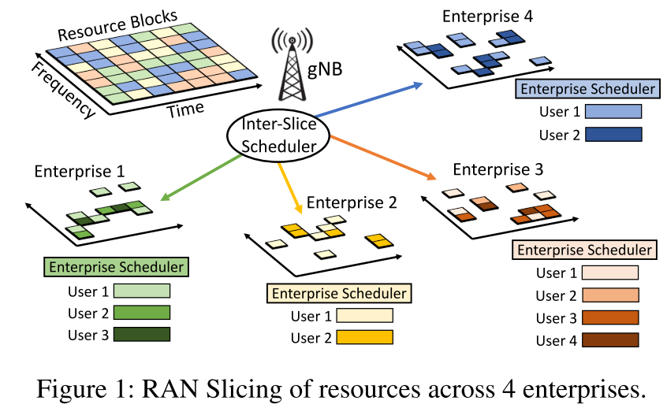
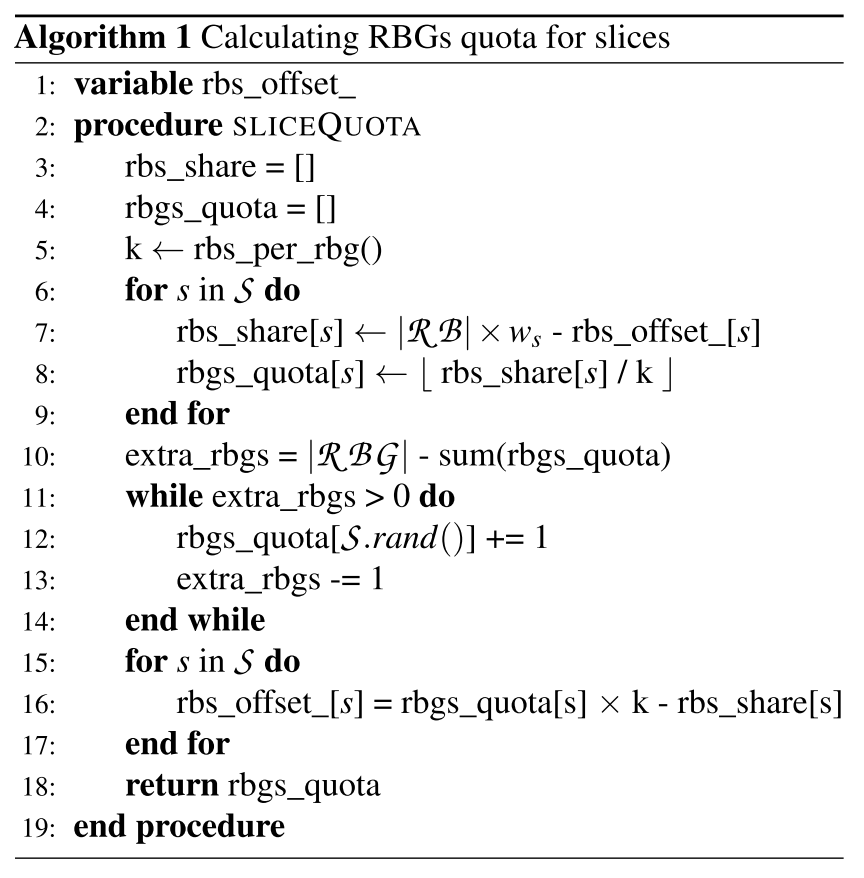

# Channel-Aware 5G RAN Slicing with Customizable Schedulers

文章主要关注5G RAN切片，即切片间的划分和单个切片内的资源分配，也就是片间和片内的调度。但是片间和片内的调度器存在循环依赖的问题，这使得很难将这两个切片级别结合起来共同感知。文章发现，如果将片内和片间调度器换成贪婪算法，循环依赖可以被打破。于是，文章设计了RadioSaber，将片间调度和片内调度结合起来，**执行信道感知的片间和片内调度(inter-slice and enterprise scheduling)。** RadioSaber的吞吐量很高，同时满足了片间的公平性和可定制的调度策略。

# 1. Introduction

网络切片：在不同的服务或用户群中划分网络资源，创建虚拟的可定制网络。使得单个用户$\to$用户组，支持具有不同需求的新应用程序。

用户组会与运营商签订服务等级协议(SLA)，提供两个功能：
- 管理服务类型和分配给切片的资源总量(提供精准的低延迟通信或大规模的物联网连接)
- 允许定制虚拟网络并对网络资源进行动态管理(在不同时间对关键远程手术流量设置优先级)

文章主要讨论5G RAN切片，目的是将基站的物理层资源分配给连接在该基站上的设备的不同enterprise。这些资源大概包括时隙和传输子带等。

理想情况下，资源是这么分配的：
- 高频谱效率
- 遵循SLA协议，保证公平性
- 允许自定义调度策略

困难：无线信道质量的动态变化

过去的工作：考虑到了信道感知频谱分配问题、分层资源调度问题、移动虚拟网络运营商背景下的RAN虚拟化问题，但这些工作只能考虑同一切片内用户的信道质量。也就是说，片间调度器不考虑信道质量给切片分配资源后，片内才考虑信道质量给用户分配资源——会显著降低吞吐量。

信道感知调度在二者间的应用是**先有鸡还是先有蛋的问题。** 二者都需要获取对方的资源分配情况来进行信道感知调度，同时不进行信道感知调度就无法确定本身的资源分配情况，这就是二者间的循环依赖问题。一种可能的解决办法是枚举出所有可能的资源分配方法，但复杂度极高，没有应用价值。

RadioSabor：在片间调度器和企业调度器上实现信道感知资源分配，同时允许每个企业定制其调度策略。

设计想法：由于二者都需要在基站上进行实时调度，因此片间调度器可以将企业调度算法作为自己算法的子程序。

**"如果我们将资源X给切片A，片A中的哪个用户将获得资源X？"**，这段话是RadioSabor的主要思想。按照这句话的思路，如果企业调度器能够回答片间调度器的查询，而不考虑其他因素、不依赖于片间分配器给它分配的其他资源，那么片间调度器就能在考虑信道质量的情况下进行资源分配。这样就可以确定将某一资源分配给某一切片后能够获得最佳的信道质量，让网络资源管理更高效和公平。

但是，回答这个查询也限制了企业可以运行调度策略的空间，这使得企业调度器必须在不考虑未来可能获得的其他资源的情况下，决定如何分配当前的资源——即时、独立地对资源进行分配决策。分配时，在考虑过去资源分配情况的基础上遵循贪婪算法，只考虑当前最好的选择，不考虑未来所有可能的情况。这样，RadioSaber能够适应既感知信道又灵活满足不同分片需求的策略。

贡献：
- 提出了在片间调度器和企业调度器上都都具有通道感知能力的RAN切片
- 提出了新的RAN虚拟化框架，抽象化物理层调度，同时为企业提供调度器接口
- 效率、公平

# 2. Background and Related Work 

背景：资源块、数据速率、感知信道的调度、RAN分片

相关工作：NVS(Network Vertualization Substrate，网络虚拟化底层)。NVS的工作方式是，在一个传输时间间隔(TTI)内将所有资源块分配给一个单独的切片，不考虑信道质量。该算法采用加权轮询机制在分片间切换，以达到SLA规定的每个切片的目标吞吐量。NVS允许企业调度器考虑信道质量，而片间调度器不考虑信道质量。

过去的工作也考虑了支持切片间的动态需求和截止日期，但所有的工作都默认片间调度器不知道信道质量的条件下进行资源分配。

# 4. RadioSaber's Design

**设计目标：**
RadioSaber解决了在k个片上划分N个RB(一个或多个TTI)，然后在该片内的UE上划分分配给每个片的RB的问题。

满足以下目标：

- 切片间的加权公平性：每个分片必须获得其公平的资源块份额。
- 高频谱效率：系统必须高效地分配RBs，以最大化系统吞吐量。
- 可定制的企业调度程序：提供表达性接口，允许指定和运行调度策略。

## 4.1 Inter-Slice Scheduler(片间调度器)

文章将片间调度逻辑分成两个步骤：

  1. 计算TTI中每个片的RB配额
  2. 以信道感知的方式，采用贪婪算法，将RB分配给每个片

### 计算切片份额

RadioSaber首先基于每个切片的权重计算每个切片的RBG(Resource Block Group)配额。假设每个TTI中的RB数和RBG数分别是$|\mathcal{RB}|$和$|\mathcal{RBG}|$。

一种简单的策略：将切片s的配额计算为$w_{s}\times|\mathcal{RBG}|$，$w_{s}$是切片的归一化权重。

但这种方法有一些不实际性：

  1. 非整数：这种方式计算的配额可能是非整数的，而且可能小于1，这与其他切片的数量、权重有关。不能对RBG进行非整数分配。
  2. 分配不均：如果$|\mathcal{RB}|$不是每个组中RB数量的整数倍(如k倍)，会导致最后一个RBG有较少的RB。

RadioSaber的思路：维护一个偏移量来考虑这些因素，偏移量是由每个分片的理想的目标资源块份额得到的。这个偏移量将会滚动到下一个传输时间间隔(TTI)。

偏移量就是实际获得的资源块份额和应得的RB数目之间的差异，新切片偏移量为0

首先计算每个切片的目标份额，这个数值用RB的数量表示。

表达式为$|\mathcal{RB}|\times w_{s}$ - rbs_offset_[s]

就是用其在TTI中的绝对加权份额减前一个TTI的滚动偏移量，新切片的偏移量为0。

然后计算切片的配额，这个数值用RBG的数量表示。将其设置为目标数额除以k并向下取整。

由于向下取整，会导致所有切片的配额总和小于可用的RBG数量，文章考虑将随机一个切片的配额增加1(最小整数值)，直到extra_rbgs < 0。

这么分配可能导致切片获得的RB数量不合适，文章通过更新每个切片的偏移量来捕获这一点。在计算下一个TTI的配额时，当前配额超过其公平配额的切片将获得正向偏移量和较低的份额；而当前配额低于其公平配额的切片将获得负向偏移量和较高的份额。

### 将RBG分配给切片

为了最大化频谱效率，在给定切片配额的情况下，要以信道感知的方式将RGB分配给切片。

