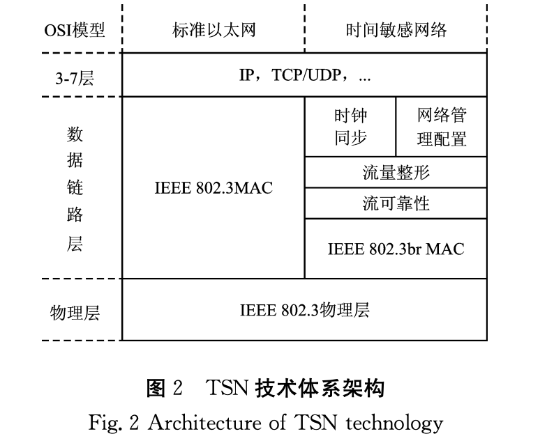

# 时间敏感网络研究现状及发展趋势（TSN）

TSN面向工业物联网、车载网络、航空航天等。

以太网设计时未考虑实时性的问题，实时通信是许多行业的基本要求，于是针对各个行业的需求开发了相应的协议，但协议间不具有可扩展性，无法兼容。为了提高效率和降低成本，时间敏感网络（TSN）诞生了，旨在使以太网的实时传输能力标准化。

**核心技术**

TSN是以标准以太网为基础，在数据链路层提供确定性数据传输服务的标准化网络技术；补充增强了时钟同步、流量整形、网络管理配置和流可靠性传输的机制。

TSN以流为对象，提供相应的QoS。TSN中定义了三种类型的流：
1. 周期性的强实时计划流，ST
2. 非周期的，具有一定实时性要求的流-音视频流，AVB
3. 非周期的，无实时性要求的流-尽力转发流，BE

思想：将不同传输需求的流划分成不同优先级，在全局时钟同步的基础上，以时分复用的方法，将ST与后两者隔离，保证ST的传输确定性。为AVB和BE提供异步的整形方法，保证AVB一定的实时传输质量，同时保证BE也有传输机会。

时钟同步：

对本地时钟进行操作，实现网络中统一的时间基准，从而控制不同设备同步执行操作。这是TSN中低时延流控技术得以实现的先决条件。

时钟同步的研究主要分为同步机制，同步精度和实现方法三个方面。

流量整形：

为不同类型的流量提供不同的质量服务

网络管理配置：

收集应用需求，规划ST流的传输并生成门控列表（GCL）下发给各个TSN设备，为AVB设备预留带宽。

流可靠技术：

通过冗余的方法，解决网络传输可靠性的问题

帧的复制和消除可靠性（FRER）：

通过备份数据并发送至不同链路的方法实现空间冗余，对物理链路故障和帧丢失都有鲁棒性，提高数据传输的可靠性

**TSN仿真**

仿真工具：OMNeT++，与INET结合使用。

**TSN应用**

专用领域：如车载网络；集成TSN和Sercos的树形网络拓扑；OPC-UA和TSN集成

无线技术：5G和Wi-Fi扩展到TSN中是热点问题。当下TSN主要是基于有线的以太网系统。

关键软硬件设计：FPGA包含PTP、交换机硬件排队系统的限制

**面临的挑战**

1. 流量等级的自适应分配

TSN中的流量根据已知的需求和配置进行登记划分，并分配合适的流整形器。但该方法受到外界网络变化影响的程度较大，会导致配置变化，影响网络的运行。

需要一种机制来实时识别网络状态的变化，并在线无缝修改流量的等级配置。

2. TAS调度和可靠性路由的集合

路由是指路由器从一个接口上收到数据包，根据数据包的目的地址进行定向并转发到另一个接口的过程

TSN为最小化关键流的端到端延时，会采用最短路径路由或均衡负载的等效多路径路由，可能导致多个关键流选择同一路径，延时增加，无法调度。

研究上：结合路由、TAS调度、可靠性三者中的两者

工程上：同时考虑三者，是重要挑战

3. 仿真设计和硬件完善

**发展趋势**

技术完善：

1）TSN自动化配置：按照任务需求、网络资源和响应时间自动生成网络调度表并完成配置的TSN自动化配置机制

2）安全性增强：802.1Qci协议过滤突发帧+区块链技术支持数据的保密性+Hash算法

技术集成：

TSN与OPC-UA、TSN与边缘计算、TSN与5G

# 时间敏感网络中确定性传输技术综述

工业以太网标准被分为三类：
1. 位于TCP/UDP/IP协议族之上，优势是不改变IP层及其以下的传输协议，能很好地兼容以太网；缺点是时延有不确定性
2. 位于以太网之上，不改变以太网及以下的传输协议

