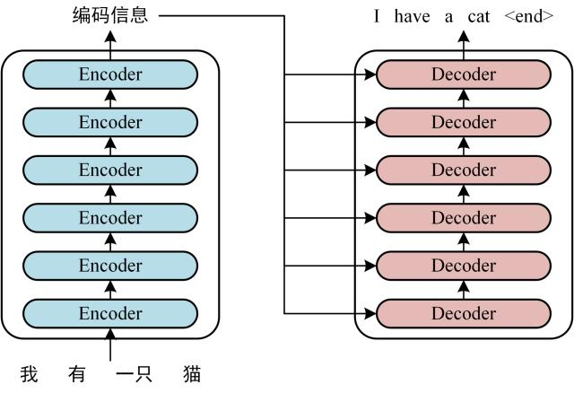
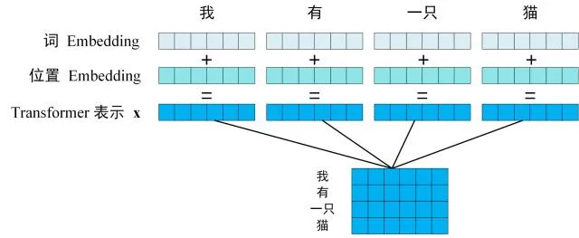
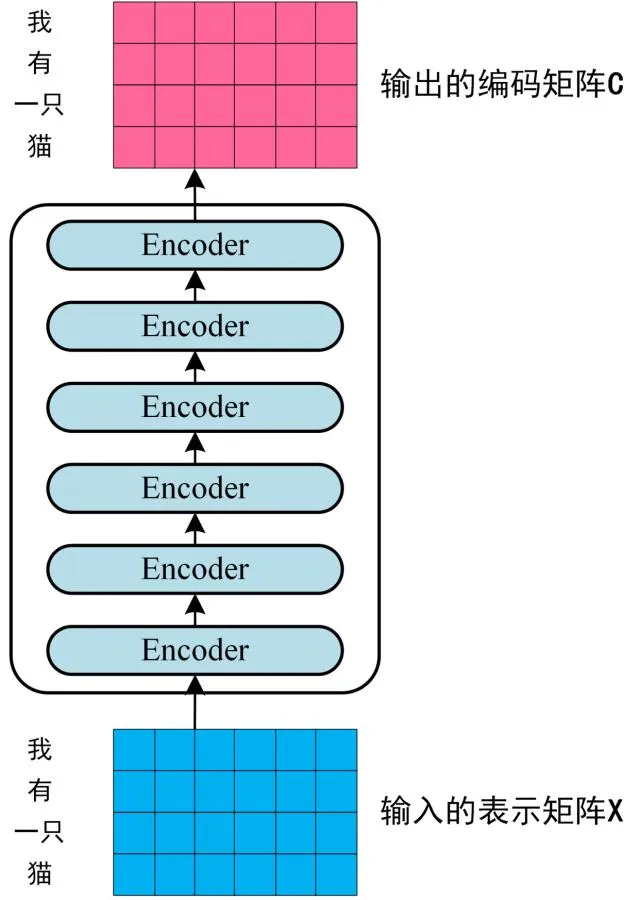
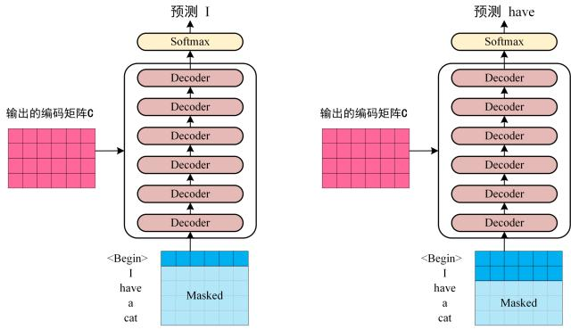

# 强化学习和资源调度任务中的Transformer
## Transformer
Transformer模型由2017年的一篇论文《Attention is all you need》提出，下图是Transformer用于中英文翻译的结构图：

可以看到Transformer由**Encoder**和**Decoder**两部分组成，Encoder和Decoder都包括6个Block。
Transformer的工作流程大体如下：
1. 首先获取输入句子的每一个单词表示向量**X**，**X**由单词的 Embedding向量和位置Embedding向量相加得到（Embedding指从原始数据提取出来的Feature），最后得到单词表示向量矩阵。

2. 将得到的单词表示向量矩阵传入到Encoder中，经过Encoder的6个Block后可以得到句子所有单词的编码信息矩阵**C**。
单词向量矩阵用$X_{n \times d}$表示，n是句子中单词个数，d是单词向量的维度，每个Encoder block输入输出完全一致。

3. 将Encoder输出的编码信息矩阵**C**传入到Decoder中，Decoder会根据当前翻译过的单词1～i翻译下一个单词i+1。使用时，翻译到单词i+1的时候需要通过Mask将单词i+1的信息隐藏掉。

Decoder接收了Encoder的编码矩阵**C**，然后输入一个翻译开始符"<Begin>"，预测第一个单词"I"；然后输入翻译开始符"<Begin>"和单词"I"，预测单词"have"，以此类推，这就是Transformer的工作流程。

## Transformer输入

